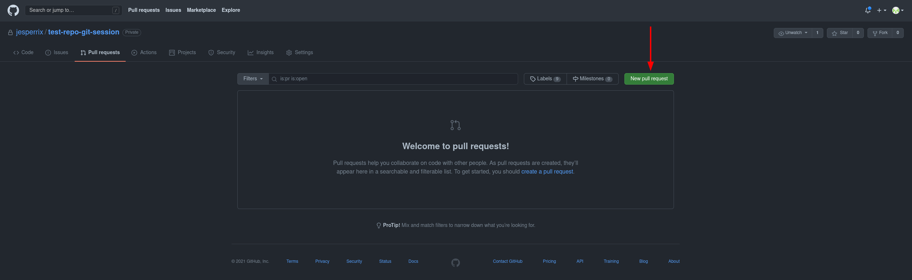
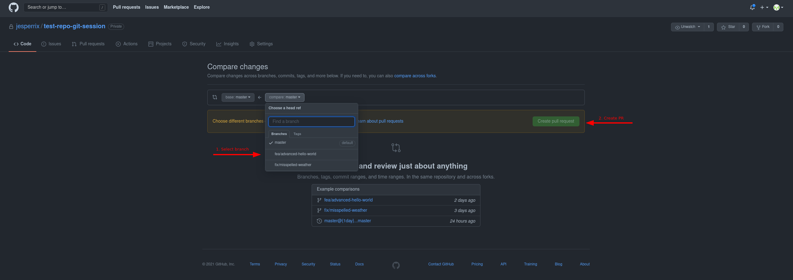

# Git session

This is an interactive git tutorial covering some of the basics of git, with the _Pull Request Workflow_.

## Sections

1. [Start a new repo](#start-new-repo)
2. [Create a fix branch](#create-a-fix-branch)
  * [Check git log and inspect the commit](#check-git-log-and-inspect-the-commit)
3. [Create another branch before merging the fix branch](#create-another-branch-before-merging-the-fix-branch)
  * [Stage part of file and commit](#stage-part-of-file-and-commit)
  * [Create a commit from web (simulate co-worker)](#create-a-commit-from-web-simulate-co-worker)
  * [Force merge conflict and fix it](#force-merge-conflict-and-fix-it)
  * [Reset and use rebase instead](#reset-and-use-rebase-instead)
4. [Create a Pull Request (fea branch)](#create-a-pull-request-fea-branch)
5. [Cherry-pick vs. rebase](#cherry-pick-vs-rebase)
5. [Revert a commit](#revert-a-commit)


### Start new repo
1. create empty git repository at github.com

2. clone the repository and cd into it
```
git clone your-new-repo
cd your-new-repo
```

3. create a file, stage and commit to the master branch
```
echo 'hello, world!' > hello_world.txt
git add hello_world.txt
git commit -m "adds hello_world.txt"
```

4. make a change to the file and commit again (intentional misspelling)
```
echo 'The weter is good!' >> hello_world.txt
git add hello_world.txt
git commit -m "adds extra line to hello_world.txt"
```

5. push the changes
```
git push
```

### Create a fix branch
Correct the misspelling from original commit.

1. create a fix branch
```
git checkout -b fix/misspelled-weather
```
2. fix the misspelling
```
sed -i "s/weter/weather/" hello_world.txt
```
3. check the corrected
```
git status
git diff hello_world.txt
```
4. stage the file and commit the fix
```
git add hello_world.txt
git commit -m "fix weather misspelling"
```
5. push the branch to upstream
```
git push
# Git tells us that no upstream exists yet.
git push --set-upstream origin fix/misspelled-weather
```

##### Check git log and inspect the commit
**git log**
```
# default log view
git log

# show a compact view
git log --oneline 

# git log with diff
git log -p

# git log with graph
git log --all --graph
```

**git show**
```
git show HEAD
# or
git show <commit sha>
```

### Create another branch before merging the fix branch
1. Go back to the master branch
```
git checkout master
```
2. Verify modification from _fea/misspelled-weather_ branch is not on master
```
cat hello_world.txt
```
3. Create new branch
```
git checkout -b fea/advanced-hello-world
# Verify
git log --all --graph --decorate
```
4. Get up-to-date with other branch
```
git rebase fix/misspelled-weather
# verify
git log --all --graph --decorate
# push
git push --set-upstream origin fea/advanced-hello-world
```
5. modify a file, and discard changes
```
# add something random to the hello_world.txt
git diff
# or
git diff hello_world.txt

# check the status (modified: hello_world.txt)
# NOTE: git is good at recommending actions.
git status

# discard the modifications
git restore hello_world.txt
```

5. modify the file
```
# changes to make sure it can be split into 2 hunks, see below.
echo -e "I am the 1st line of this file\n\n\n$(cat hello_world.txt)" > hello_world.txt
sed -i "s/is good/is great/" hello_world.txt
echo 'how do you do?' >> hello_world.txt
```

##### Stage part of file and commit
1. stage part of the file (useful for splitting commits)
```
git add -p hello_world.txt
# press s for split
# press y at the 1st hunk
# press n at the 2nd hunk
git status
```
2. commit changes
```
git commit -m "add more text to hello_world.txt"
```

3. oops, I forgot some changes in the commit
```
# Check status
git status
# stage 
git add hello_world.txt
# amend staged changes to the previous commit
git commit --amend
```

4. push the changes
```
git push
```

##### Create a commit from web (simulate co-worker)
1. substitute _1st_ with _first_, insert _big_ before world and remove a newline:
```
I am the first line of this file

hello, big world!
The weather is great today!
how do you do?
```

2. commit with following message: _update hello_world.txt (from web)_

3. fetch the changes locally without merging
```
git log --all
# fetch all updates tho branches
git fetch --all
# verify the origin branch is ahead
git log --all
```

##### Force merge conflict and fix it
1. modify hello_world.txt again
```
# remove the 3 first lines.
sed -i '1,3d' hello_world.txt
```

2. stage and commit the changes
```
git add hello_world.txt
git commit -m "clean the hello_world.txt file"
```

3. push the changes
```
git push
# oops, the HEAD is behind the remote
```

4. pull the changes from the remote, which creates a conflict, since both modified the same file
```
git pull

# git status often help with what commands to run next
git status
```

5. fix conflicts

6. conclude the merge
```
# check status for what commands to run
git status

# add, then run git commit
git add hello_world.txt
git commit
```

7. Visualize the merge you just did:
```
git log --all --graph --decorate

# Now you created a merge bubble
#  master   *---*---*---*---*
#                \         /
#  my branch      *---*---*

# What you wanted were:
#  master   *---*---*---*
#                        \
#  my branch       -->    *---*---*

```

##### Reset and use rebase instead
1. undo what we just did
```
# git reset --hard <commit before merge>
git reset --hard HEAD^
```
2. like before pull, but using `--rebase`
```
git pull --rebase

# git status
git status
```
3. fix conflicts

4. conclude the merge
```
# check status for what commands to run
git status

# add, then finalize the rebase
git add hello_world.txt
git rebase --continue
```

5. Show the rebase:
```
git log --all --graph --decorate

# now we got what we wanted, a clean history without merge bubbles:
#  master   *---*---*---*
#                        \
#  my branch       -->    *---*---*

```

5. Now push the changes
```
git push
```

### Create a Pull Request (fea branch)

1. Go to the repositiory at github.com

2. Switch to the Pull requests tab and click on _New pull request_ (see the below image)


3. Now select the _fea/advanced-hello-world_ branch for the Pull request and click _Create pull request_ (see the below image)


4. perform review and iterate suggested changes

5. select _squash and merge_

6. see commit history for the master branch

### Cherry-pick vs. rebase
Cherry-pick can be used to "cherry pick" commits from another branch.

```
git cherry-pick <commit sha>
```

#### cherry-pick the squash commit to the fix-branch for fun
1. switch to the fix branch and fetch changes
```
git checkout fix/misspelled-weather
git fetch --all
```
2. cherry pick the squashed commit from master
```
# find the commit sha from the git log
git cherry-pick <commit sha>
```
3. fix conflicts

4. conclude the cherry-pick
```
# check status for what commands to run
git status

git add hello_world.txt
git cherry-pick --continue
```

5. see the log
```
git log --all --graph --decorate

# now the fix branch has the squash commit as well
```

6. Now push the changes
```
git push
```

### revert a commit
Lets say the previous feature somehow where unintended and we wants to undo it.

1. switch back to the master branch
```
git checkout master
```

2. make sure all changes are present
```
git fetch --all
```

3. see the history and make sure we are up to date with the remote
```
git log --all
git pull --ff
```

4. revert the unintended commit.
```
git revert <commit sha>
```
